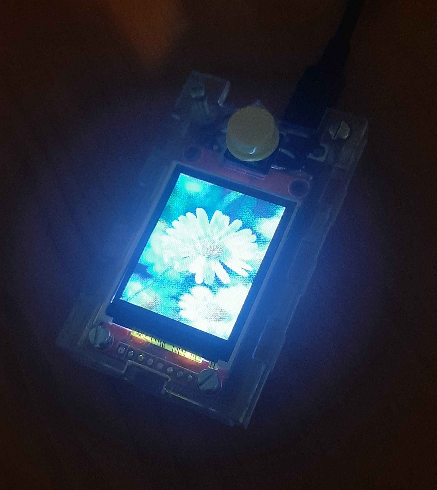

Darilo za mojo Moniko. Tole je naprava, ki združuje ESP32 in OLED zaslon, da lahko od doma preko Google Sheets uporabnik naloži datoteko in napis, ki jo naprava samodejno prenese, ko dobi povezavo do interneta in lahko zazna spremembo datuma. Sliko beleži v internem spominu (SPIFFS), v kolikor ne bi imela dostopa do interneta. 

Koncni izdelek             |  Nacrt za ohisje z baterijo
:-------------------------:|:-------------------------:
  |  

Navodila za uporabo:
1. Izberi poljubno sliko
--------------------------------------------------------------------------
2. Odpri image resizer

2.1 Navigiraj v mapo in izberi sliko na levi strani

2.2 Klikni Add, da doda v čakalno vrsto na desno (lahko več slik)

2.3 Advanced options -> 128 širina, 160 višina, checkbox za aspect ratio prazen

2.4 Output format: .jpg, poljubna destinacija za output in ime

2.5 Convert

---------------------------------------------------------------------------
3. Odpri LCD Image Converter

3.1 File -> Open -> Odpri sliko (za vse enak postopek)

3.2 Options -> Convertsion...

3.3 Preset: Color R5G6B5

3.4 Zavihek Image -> Block size: 16bit

3.5 Show Preview -> CTRL+A -> CTRL+C

-----------------------------------------------------------------------------
4. Odpri Google Sheets tabelo

4.1 V primeren zavihek poglej v polja A17 do A20. Če so 1ke napisane, lahko naložiš novo sliko in tekst

4.2 Zbriši stolpec C in prilepi kopirano v polje C1. Zapiši novo besedilo v polje G3.
